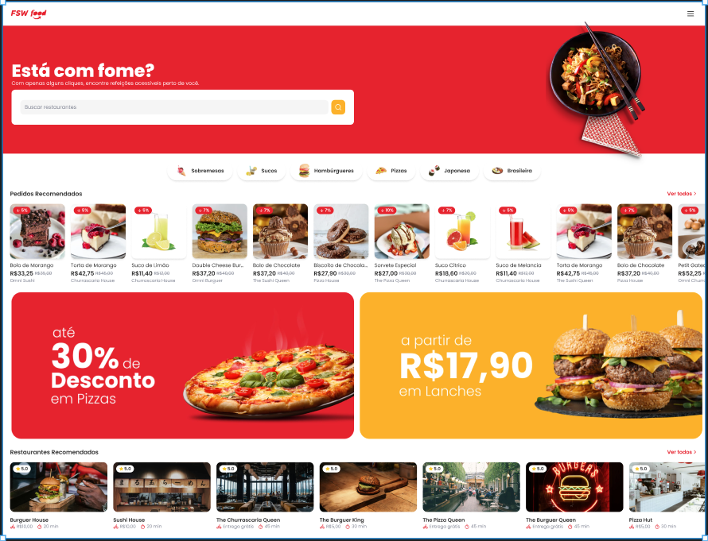

<h1 align="center">
  
</h1>

##  Roteiro

- [Sobre](#sobre)
- [Tecnologias](#tecnologias)
- [Requisitos](#requisitos)
  - [Requisitos Funcionais (RF)](#requisitos-funcionais)
  - [Requisitos Não-Funcionais (RNF)](#requisitos-nao-funcionais)
- [Pré-requisitos](#pre-requisitos)
- [Instalação](#instalacao)
- [Executando](#executando)
- [Contribuindo](#contribuindo)
- [Layout](#layout)
- [Deploy](#deploy)
- [Autor](#autor)
- [Licença](#licenca)

<p align="center">

</p>

##  Sobre

Sistema de Delivery de Comida inspirado em plataformas populares como iFood.

##  Tecnologias

O projeto foi desenvolvido com as seguintes tecnologias:

- [TypeScript](https://www.typescriptlang.org/)
- [React.js](https://react.dev/)
- [Next.js](https://nextjs.org/)
- [Tailwind CSS](https://tailwindcss.com/)
- [Shadcn/UI](https://ui.shadcn.com/)
- [Node.js](https://nodejs.org/en)
- [Prisma](https://www.prisma.io/)
- [PostgreSQL](https://www.postgresql.org/)
- [Supabase](https://supabase.com/)

##  Requisitos

O projeto está em desenvolvimento.

### Requisitos Funcionais (RF)

- [x] Os usuários devem poder selecionar itens de menu de restaurantes disponíveis.
- [x] Os usuários devem poder adicionar itens ao carrinho de compras.
- [x] Os usuários devem poder visualizar e editar o carrinho antes de finalizar o pedido.
- [x] Os usuários devem poder visualizar o histórico de pedidos anteriores.
- [x] Os usuários devem poder visualizar sobre o status do pedido em tempo real.
- [x] Os usuários devem poder acessar uma lista de restaurantes marcados como favoritos.
- [x] Os usuários devem poder remover restaurantes da lista de favoritos.
- [x] Os usuários devem poder navegar por diferentes categorias de alimentos (por exemplo, pizza, hambúrgueres, comida chinesa).
- [x] Os usuários devem poder pesquisar restaurantes pelo nome.
- [x] Os usuários devem poder criar uma conta no sistema.
- [x] Os usuários devem poder fazer login utilizando o cadastro criado.
- [x] Os usuários devem poder fazer logout de suas contas criada.
- [x] Os usuários devem poder fazer login utilizando suas contas do Google.
- [x] Os usuários devem poder fazer logout de suas contas do Google.
- [x] suporte para diferentes tamanhos de tela e dispositivos.

### Requisitos Não-Funcionais (RNF)

- [x] O sistema deve ser capaz de lidar com um grande número de usuários simultaneamente.
- [x] O tempo de resposta do sistema deve ser rápido para garantir uma experiência de usuário fluida.
- [x] A interface do usuário deve ser intuitiva e fácil de usar em dispositivos móveis.
- [x] O sistema deve ser dimensionado para lidar com um aumento na demanda à medida que mais usuários se registram e fazem pedidos.
- [x] O aplicativo deve ser compatível com uma variedade de dispositivos e sistemas operacionais móveis, como iOS e Android.

##  Pré-requisitos

Você deve verificar aos seguintes pré-requisitos para poder instalar e executar o projeto:

1. Você deve ter instalado um editor de código: [VS Code](https://code.visualstudio.com/download/).
2. Você deve ter instalado o [Git](https://git-scm.com/downloads/).
3. Você deve ter instalado o [Node.js](https://nodejs.org/en/).
4. Você deve ter uma conta no [Supabase](https://supabase.com).
5. Você deve ter uma conta do [Google](https://gogole.com/) e [Console Cloud Google](https://console.cloud.google.com/)

##  Instalação

Você deve seguir o passo a passo para instalar o projeto:

1. Você deve abrir o terminal e clonar o repositório do projeto

```bash
git clone https://github.com/uillasnr/fsw-foods.git
```

##  Executando

Você deve seguir o passo a passo para executar o projeto:

1. Você deve entrar na pasta do projeto clonado

```bash
cd fsw-foods
```

2. Você deve abrir a pasta do projeto clonado no editor de código de sua preferência. Caso seja o [VS Code](https://code.visualstudio.com/download/) digite o comando

```bash
code .
```

3. Você deve instalar as dependências do projeto

```bash
npm install
```

ou

```bash
yarn install
```

ou

```bash
pnpm install
```

4. Você deve criar um arquivo `.env` na raiz do projeto

5. Você deve criar um projeto no Supabase e copiar a Connecting String algo parecido como `postgres://postgres.[*****************]@aws-0-us-west-1.pooler.supabase.com:5432/postgres` e colar no arquivo `.env` dessa forma

```env
DATABASE_URL="Você deve colar entre as aspas a Connecting String"
```

6. Você deve executar o seguinte comando

```bash
npx prisma db seed
```

7. Você deve acessar o [Console Cloud Google](https://console.cloud.google.com/) e criar um projeto

8. Você deve selecionar o projeto criado

9. Você deve ir até `APIs e Serviços` e clicar em `Tela de permissão OAuth`

10. Você deve marcar o `User Type` como `Externo`

11. Você deve preencher as informações do app, salvar e continuar

12. Você deve clicar em `PUBLICAR APLICATIVO`

13. Você deve ir até `Credenciais` e clicar em `CRIAR CREDENCIAIS`

14. Você deve escolher `ID do cliente OAuth`

15. Você deve escolher o Tipo de Aplicativo como `Aplicativo da Web`

16. Você deve adicionar na seção `Origens JavaScript autorizadas` a seguinte URI: `http://localhost:3000`

17. Você deve adicionar na seção `URIs de redirecionamento autorizados` a seguinte URI: `http://localhost:3000/api/auth/callback/google`

18. Você deve copiar o `ID do cliente` e a `Chave secreta do cliente` e colar no arquivo `.env` dessa forma

```env
GOOGLE_CLIENT_ID="Você deve colar entre as aspas o ID do cliente"
GOOGLE_CLIENT_SECRET="Você deve colar entre as aspas a Chave secreta do cliente"
```

19. Você deve criar uma variável de ambiente no arquivo `.env` com o seguinte nome `NEXTAUTH_SECRET` o conteúdo dessa variável pode ser qualquer coisa

```env
NEXTAUTH_SECRET="1234"
```

20. Você deve poder executar o projeto

```bash
npm run dev
```

ou

```bash
yarn run dev
```

ou

```bash
pnpm run dev
```


##  Layout

Você pode visualizar o layout do projeto através [DESSE LINK](https://www.figma.com/file/uQIgYk6xDRWgjHCjlaDYBo/%5BLIVE%5D-FSW-Foods?type=design&node-id=381-7368&mode=design). É necessário ter conta no [Figma](https://figma.com) para acessá-lo.

##  Deploy

[Acesse o projeto finalizado, online](https://fsw-foods-liart.vercel.app/)

##  Autor

<a href="https://github.com/uillasnr">
  
  <br />
  <sub>
    <strong>Uillas nascimento reis</strong>
  </sub>
</a>

Feito por Uillas  Entre em contato!

[](https://www.linkedin.com/in/uillasnr)
[](wiliasreis@hotmail.com)
[](https://wa.me/5511991654732)

